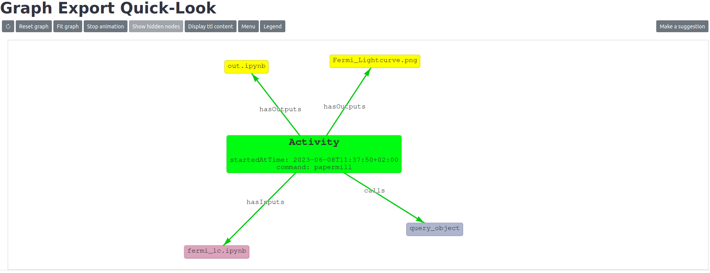

# renku-graph-vis

## Graphical visualization of the graph
Starting from the knowledge graph extracted from the renku project, this is queried to retrieve the needed information, 
perform some inferring and generating an interactive graphical representation.

In particular, two commands are provided:
<!-- TODO deprecated? -->
* `display` to generate a representation of the graph over an output image (probably will be deprecated)
* `show-graph` to start an interactive visualization of the graph over the browser 

### `display` command
<details>

<summary>CLI command</summary>

CLI command to output a graphical representation of the graph over a png image.

In particular, the following information are elaborated:
* inputs/arguments/outputs of the single workflow (eg notebook execution);

#### Parameters

* `--filename` The filename of the output file image, until now, only png images are supported (eg `--filename graph.png`), default is `graph.png`
* `--input-notebook` Input notebook to process, if not specified, will query for all the executions from all notebooks  
* `--revision` The revision of the renku project at which the graph should be extracted, defaults to `HEAD`    
```bash
$ renku graphvis display
 ```


#### Specify executed notebook
```bash
$ renku aqs display --input-notebook final-an.ipynb
 ```


</details>

### `show-graph` command

CLI command to generate an interactive, web-based, graphical representation of the graph.

```bash
$ renku graphvis show-graph
 ```



The user can interact with the graph via a single click on one of its nodes: upon clicking, 
a `SPARQL` query is dynamically built, and this will retrieve all the nodes and edges directly 
connected to the clicked node, as shown in the animation below. Once the node has been expanded, 
the newly added nodes, along with the other leaves nodes that are connected to the previously 
clicked node, can be re-absorbed by clicking again on the very same node. This is also visible 
in the animation below.

<div align="center">

</div>
<br clear="left"/>

The interface provides the user with a number of adjustable options:

<!-- TODO to improve hierarchical layout -->
* **Change graph layout**: Two possible layouts are at the moment supported
  * _random_: where nodes and edges are displayed in a random fashion over the dedicated frame 
  (this layout is used in the above picture)
  * _hierarchical_: where a hierarchical visualization is applied to the nodes and the edges, an example of 
  this is displayed in the image below
  <div align="center">
  
  </div>

* **Enable/disable selection of subsets of nodes**: filtering of certain subset of nodes (eg astroquery-related nodes).
This is configurable via a dedicated json file.
<div align="center">

</div>

* **Apply reductions on the graph**: allows to enable the display of certain nodes with the relative child ones 
absorbed within, and viceversa (eg in the example images, the `Activity` node has a number of child nodes, those
can be visualized inside the `Activity`, left image, as well as regular separate ones, right image).
This is configurable via a dedicated json file.
<div align="center">


</div>
<br clear="left"/>

* **Enable/disable graphical configurations for the graph**: enable/disable a set of graphical configurations for
the graph (nodes and edges), where each configuration is loaded from a dedicated json file. In the image displayed below,
two json files have been loaded, and the related checkbox will enable/disable that configuration.
<div align="center">

</div>


The functionalities for the graph drawing and the user-interactions with it are developed in a dedicated javascript library.
This is available at the following [repository](https://github.com/oda-hub/renku-aqs-graph-library/).

### Graph visualization within a renkulab session

The graph can be displayed during an interactive renkulab session. This is provided by including the `renku_graph_vis` 
within the requirements of your project. A dedicated button will then be displayed in the renkulab launcher when a 
new session is started.  

<div align="center">

</div>

The graph is dynamically updated while working in the session. In the example below, the execution of a notebook
is started, and when this completes the graph is automatically re-loaded, including the execution that had just
completed.

<div align="center">

</div>

*** 

```bash
$ renku graphvis inspect
 ```

# Installation of the plugin

Currently, the plugin is developed using the version `2.4.1` of [renku-python](https://github.com/SwissDataScienceCenter/renku-python). Please make sure such version is installed by running:

```bash
renku --version
```

The versioning of the dependency is guaranteed during the installation of the plugin, and in addition a dedicated check will be performed during the import.

For the installation of the plugin via `pip`:

```bash
pip install renku_graph_vis
```
